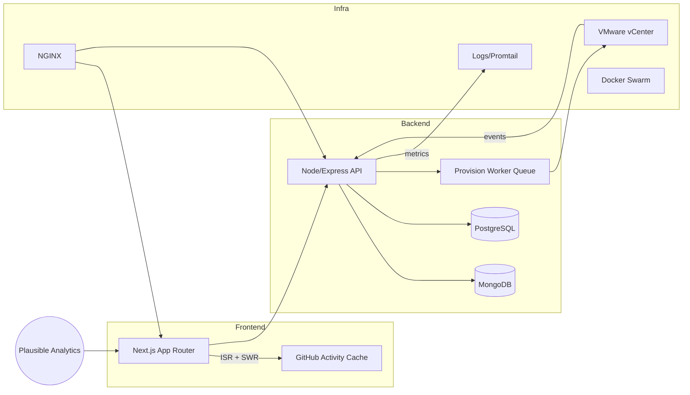

## Context & Goals

UMBC’s cybersecurity courses needed an on-demand lab platform that could provision isolated VMware environments per class cohort, map campus SSO roles to fine-grained app permissions, and expose real-time health metrics for faculty. Prior iterations depended on manual vCenter templates, ad-hoc spreadsheets, and no audit history. I owned the rewrite—from research and system design to the production cutover.

**Constraints**

- Keep all student traffic on university infrastructure with strict network segmentation
- Integrate with UMBC’s Shibboleth SAML identity provider for faculty and student cohorts
- Meet FERPA guidelines with full audit trail and per-action logging
- Deliver a responsive UI that instructors can self-serve without VMware expertise

## Architecture

- **UI**: Next.js 14 App Router with Tailwind/shadcn/ui, React Query for real-time VM status, and React Three Fiber visuals for lab topology.
- **APIs**: Express services layered behind Zod validation and rate limiting; workers pull jobs for vCenter provisioning via VMware PowerCLI scripts executed in Node.
- **Data**: MongoDB stores session/audit data, PostgreSQL tracks course-to-lab relationships and RBAC policies for analytics.
- **Infra**: Docker + NGINX reverse proxy with TLS, health checks, and blue-green deploys. Promtail + Loki collect logs, while Grafana dashboards surface metrics to faculty.

## Key Challenges & Solutions

### SAML/SSO mapping & session security

- Implemented SAML SSO with signed assertions, encrypted NameIDs, and faculty/student role mapping using campus LDAP attributes.
- Hardened session cookies (`SameSite=strict`, `HttpOnly`, AES-encrypted session store) with CSRF tokens and JWT audience checks.
- Added admin impersonation logging for compliance reviews.

### vCenter automation playbooks

- Built a provisioning worker that clones golden templates, attaches class-specific networks, triggers post-provision Ansible scripts, and reports readiness back to the portal.
- Snapshots and tear-down flows run on schedule, reclaiming resources nightly and posting metrics into Grafana.
- Designed a deterministic naming convention for VMs and resource pools, allowing zero-touch cleanup.

### Role-based access + audit trail

- Established RBAC roles (Faculty, TA, Student, Admin) with fine-grained scopes for power operations, console access, and log reviews.
- Every sensitive action (console connect, reimage, credential download) emits audit events via Mongo change streams to a compliance queue and is persisted in PostgreSQL for reporting.

## Developer Experience

- Standardized local development through Docker Compose, bundling Next.js, API, workers, and a mock SAML IdP.
- NGINX handles service routing, websockets, certificate termination, and health endpoints for Vercel previews and on-prem installs.
- Added pre-flight diagnostics (vCenter connectivity, template health, DB migrations) to catch issues before release.
- Continuous delivery via GitHub Actions with lint, type-check, Playwright suite, and Lighthouse scores gating deploys.

## Results

- Faculty launch labs in minutes, verifying readiness visually from the portal rather than CLI scripts.
- Audit data satisfies campus security reviews with exportable CSV snapshots.
- Students receive deterministic, clean environments with ephemeral credentials, eliminating VM conflicts.

## What I’d do next

- Autoscale provisioning workers based on queue depth with a Kubernetes operator.
- Implement per-course pool warmups to eliminate cold start times during peak class turnover.
- Self-service lab builder for faculty, letting them compose VM templates and network recipes without engineering tickets.
